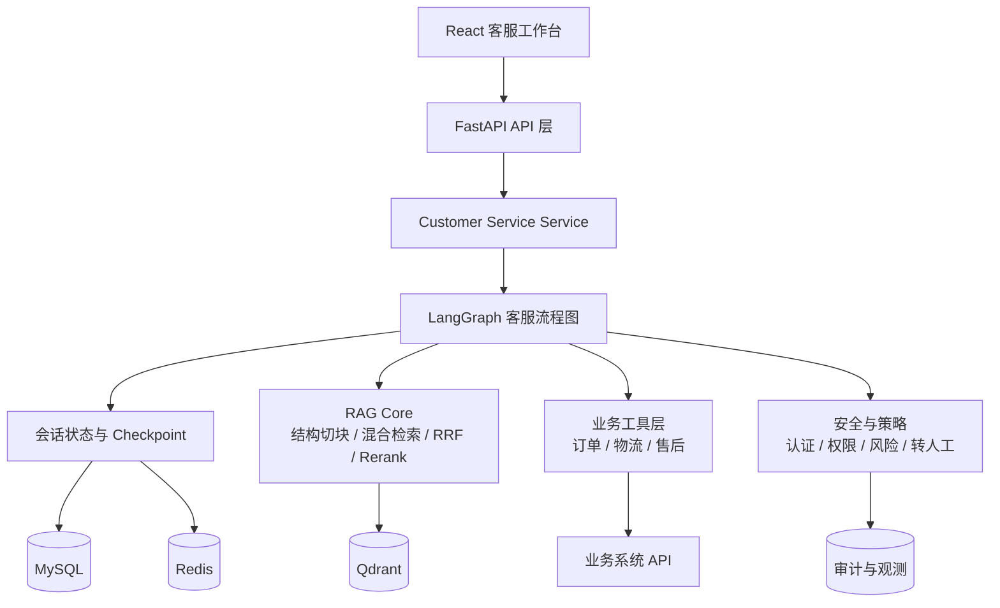
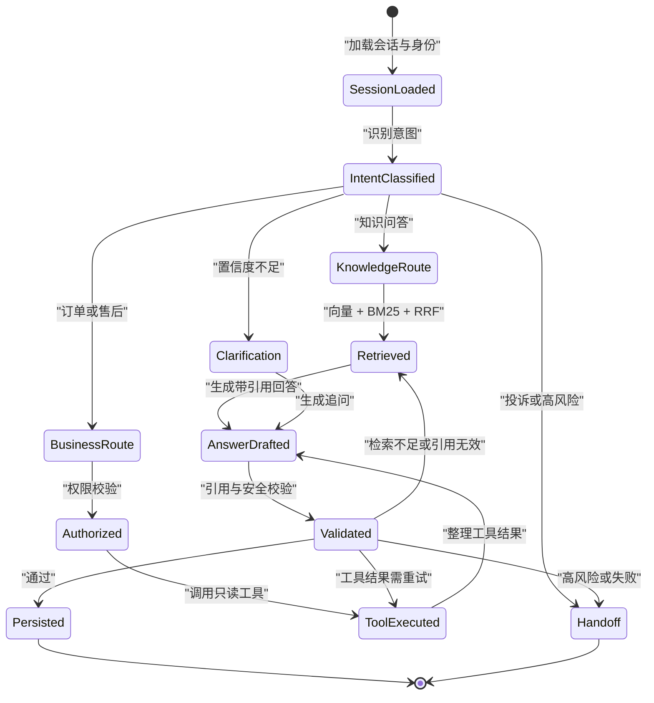
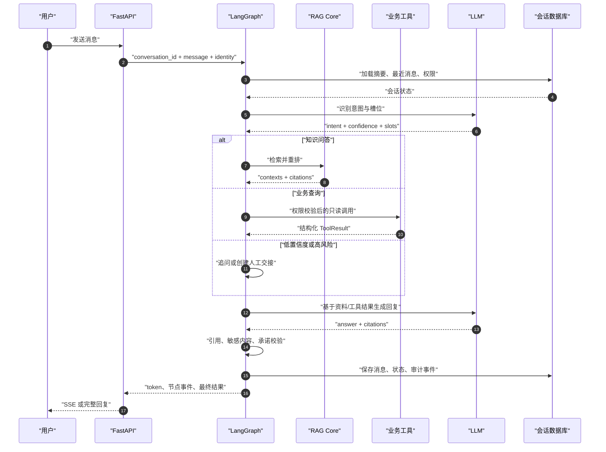
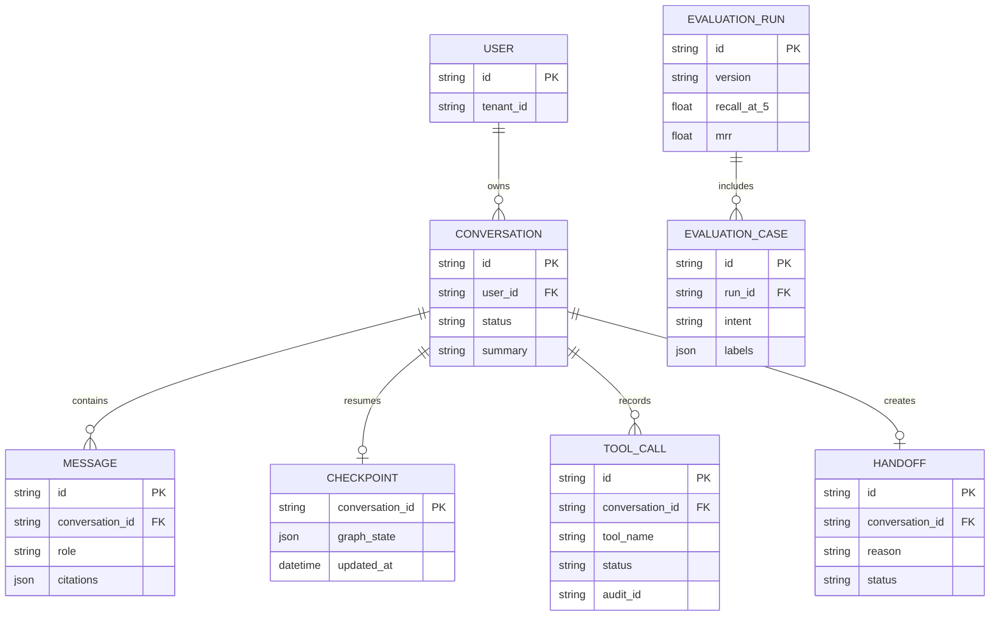

# 智能客服系统规划

## 1. 目标与原则

### 1.1 产品目标

在现有知识库问答基础上，演进为可处理多轮对话、业务查询、业务办理和人工转接的智能客服系统。

第一阶段优先解决三件事：

- 回答有依据：继续使用结构感知分块、混合检索、重排和引用校验。
- 处理有边界：涉及订单、退款、账户等操作时，必须经过身份、权限和风险校验。
- 失败可接管：资料不足、工具失败、用户不满意或高风险场景，明确转人工。

### 1.2 设计原则

- `rag/` 是独立领域能力，负责知识库、检索、重排和离线评测。
- `LangGraph` 是客服流程编排层，负责状态、路由、循环、重试和人工介入。
- `LangChain` 只作为模型、消息、Prompt、Tool 等适配接口，按需使用，不重写现有 RAG。
- 所有业务工具都通过显式接口调用，不允许模型直接拼接内部 API 请求。
- 先做可观测、可评测的单 Agent，再扩展多 Agent。

## 2. 当前基础与缺口

### 当前落地状态

客服能力已与 RAG 合并为单一 `server` 包（`from server.core.retrieve import retrieve`），Phase 1 MVP 主链路已跑通：

- 单一 `server` 包 + src 布局：`api` / `services` / `tools` / `graph` / `core` 分层，`rag` / `langgraph` / API 三层合一，无 sys.path hack、无模块名碰撞。
- `CustomerServiceState` 固化会话、意图、槽位、检索上下文、引用和人工接管字段；确定性分类器覆盖问候、知识问答、订单、售后、投诉、未知，后续可替换为 LLM 分类器。
- LangGraph 图串起会话初始化、意图路由、RAG 检索、回答生成、引用校验、澄清与转人工；节点依赖注入（retriever/generator 参数化），契约测试零外部依赖。
- 三层路由：快速业务意图 → RAG 知识优先 → 无素材澄清；连续两轮无解转人工；页面气泡「当前链路」标签 + 右侧路由高亮同步。
- 只读订单/物流工具闭环：Pydantic 参数校验、会话归属校验、超时/失败显式转人工，缺单号多轮澄清（checkpoint 恢复）。
- SSE 流式回复：知识问答逐 token；业务/澄清/转人工走图 meta 事件，前端打字机呈现。
- 人工接管闭环：转人工后坐席直接回复（`response_mode=manual`），会话进入 `manual` 状态，客户/运营双端轮询同步。
- 演示认证：`operator` / `customer` 双角色 JWT，接口按角色鉴权；客户消息身份取自 token，人工回复需运营角色。
- 云端持久化：会话/消息落 MySQL（回退内存并在响应体显性标注 `storage`）；文档切块同步存 MySQL，服务启动 lifespan 自动重建向量索引——重新部署不丢数据。
- 可观测：请求级 `trace_id` 贯穿「消息进入 → 检索 → 生成 → 落库/转人工」，统一日志输出 stdout。
- 前端双端页面：运营客服工作台（会话队列 / 对话主区 / 实时上下文 / 人工接管分栏）+ 客户聊天窗（快捷提问引导 / 流式回答 / 人工回复可见）。
- LangGraph checkpoint 生产持久化：MySQL 后端 checkpointer（`checkpoint_saver.py`），按 `thread_id=conversation_id` 存图状态，重启恢复澄清/转人工中间态。
- 客服任务评测体系 + PII 脱敏：离线评测（`cs-eval` 任务门禁 + Recall@K/MRR 检索联动）+ 在线埋点（evaluation_events）/ Prometheus（`/metrics`）+ 告警 + 三层脱敏；LLM 意图分类器可插拔替换（默认关闭）。

FastAPI 会话服务优先加载 LangGraph Agent；缺依赖或运行失败时自动回退 RAG 直答。真实业务只读接口替换演示订单源、生产级 JWT/OAuth 与多租户、限流熔断与审计留在后续迭代。

### 已具备

- FastAPI REST 接口和 React 对话界面。
- 文档解析、结构感知切块、Qdrant 存储。
- 向量 + BM25 + RRF 混合检索，可选 rerank、引用校验和 Recall@K/MRR 离线评测。
- LangGraph 图（rag 图 + 客服图）已并入 `server` 包，具备 retrieve、rerank、generate、validate、clarify、handoff 节点。
- 客服任务评测：一次解决率、转人工率、工具调用成功率、无依据承诺率等指标尚未体系化。

### 需要补齐

- 真实业务只读接口替换演示订单源；写操作（退款/改址/取消）尚未开放。
- JWT/OAuth 生产化：真实验证码、密码重置、令牌刷新、多租户隔离。
- 意图识别默认仍是确定性规则（LLM 分类器已实现但默认关闭，需 `LLM_CLASSIFIER=1` 启用；规则分类器已支持多意图风险优先级仲裁）。
- 限流、熔断与审计日志：PII 脱敏已落地，尚缺 Redis 限流、工具调用熔断、审计日志全链路落库。

## 3. MVP 范围

### 3.1 首批场景

建议先选择一个业务域，不要一开始覆盖所有客服问题：

1. 知识问答：产品说明、政策、流程、常见问题。
2. 订单查询：查询订单状态、物流状态和预计送达时间。
3. 售后咨询：判断是否需要补充信息，给出退款/换货流程。
4. 人工转接：资料不足、工具异常、投诉升级和高风险操作转人工。

### 3.2 暂不做

- 自动退款、自动改地址等不可逆操作。
- 多 Agent 协同。
- 全量历史会话长期记忆。
- 复杂营销推荐和主动外呼。

## 4. 推荐架构

### 4.1 系统分层图



边界说明：`LangGraph` 只负责客服流程状态和路由；`rag/` 只负责知识检索质量；业务工具不直接暴露数据库或内部 API 给模型。

```text
React Chat UI
      │ REST + SSE
      ▼
FastAPI API 层
      │
      ▼
Customer Service Service
      │
      ▼
LangGraph 客服流程图
      ├── 会话加载与用户身份
      ├── 意图识别与槽位提取
      ├── 风险/权限判断
      ├── RAG 检索与重排
      ├── 业务 Tool 调用
      ├── 回复生成与引用校验
      ├── 低置信度追问
      └── 转人工与终态持久化
      │
      ├── RAG Core：rag/
      ├── Business Tools：订单、物流、售后
      ├── MySQL：会话、消息、审计
      ├── Qdrant：知识库向量和结构元数据
      └── Redis：限流、短期状态和任务队列（后续引入）
```

### 架构决策

| 决策 | 方案 | 原因 |
| --- | --- | --- |
| 编排 | LangGraph | 客服需要状态、条件分支、重试、循环和人工介入 |
| LLM 抽象 | `langchain-core` 按需使用 | 获得标准消息/Tool/Prompt 接口，避免绑定完整生态 |
| RAG | 保留自研 `rag/` | 已有结构化切块、混合召回和评测，便于质量控制 |
| API | FastAPI REST + SSE | REST 适合管理资源，SSE 适合回复流和节点事件 |
| 主数据库 | MySQL | 会话、消息、用户、工具审计需要事务和查询能力；与现有 `chat_store` 持久化层一致 |
| 向量库 | Qdrant | 延续现有实现；生产环境切远端服务 |
| 认证 | MVP 使用 `conversation_id`，上线前接 JWT/OAuth | 先完成流程验证，再接入真实用户体系；业务工具必须在正式认证后开放 |
| 组织方式 | 按客服 feature 组织新增代码 | 避免把意图、工具、会话逻辑继续堆进单一 `rag.py` |

## 5. LangGraph 状态模型

### 5.1 状态生命周期



客服状态是图的核心契约，建议定义为显式 TypedDict 或 Pydantic 模型：

```text
conversation_id
user_id / tenant_id
messages
current_query
intent
intent_confidence
slots
retrieval_contexts
citations
tool_calls
tool_results
risk_level
needs_human
handoff_reason
answer
response_mode
retry_count
trace_id
```

状态要求：

- 每个节点只更新自己负责的字段。
- 工具结果和模型原始输出分开存储，便于审计。
- 不把完整敏感信息放入 Prompt；进入模型前做脱敏和最小化。
- `retry_count`、`tool_calls` 和 `risk_level` 必须有上限和白名单。
- 状态支持从任意人工接管点恢复，而不是只依赖进程内存。

## 6. 客服流程图

### 6.1 单次请求时序



```text
START
  ↓
load_session
  ↓
classify_intent
  ├── greeting/smalltalk ───────────────┐
  ├── knowledge_question → retrieve ────┤
  ├── order_query → authorize → tool ───┤
  ├── after_sale → collect_slots ───────┤
  └── complaint/high_risk → handoff ────┘
                                      ↓
                         compose_answer
                                      ↓
                         guardrail_validate
                         ├── 需追问 → collect_slots
                         ├── 需重试 → retrieve/tool/generate
                         ├── 转人工 → handoff
                         └── 通过 → persist → END
```

### 节点职责

- `load_session`：加载会话摘要、最近消息和用户权限，不加载无限历史。
- `classify_intent`：输出意图、置信度和所需槽位；低置信度进入澄清问题。
- `retrieve`：调用现有 `rag.retrieve()`，保留章节标签、RRF 分数和 rerank 分数。
- `authorize`：检查登录状态、租户、资源归属和操作权限。
- `tool`：执行只读业务查询；写操作后续必须增加确认节点。
- `collect_slots`：一次只追问最关键的缺失字段，避免连续盘问。
- `compose_answer`：统一生成格式，知识结论必须附 `[来源N]`。
- `guardrail_validate`：校验引用、敏感内容、业务承诺、工具结果一致性和转人工条件。
- `handoff`：生成交接摘要、最近上下文、工具结果和转人工原因。
- `persist`：保存消息、状态、指标和审计事件。

## 7. 工具边界

工具接口建议按业务域拆分，并统一返回结构：

```text
ToolResult:
  success: bool
  data: object | null
  error_code: string | null
  user_message: string | null
  audit_id: string
```

第一批工具只开放只读能力：

- `get_order_status(order_id)`
- `get_logistics_status(order_id)`
- `get_after_sale_policy(order_type)`
- `create_handoff(reason, summary)`

工具必须满足：参数 Pydantic 校验、超时、重试上限、权限检查、幂等标识、结构化日志和审计记录。退款、改址、取消订单等写操作必须经过“展示影响 → 用户确认 → 再执行”三步流程。

## 8. API 规划

### 会话

- `POST /api/v1/conversations`：创建会话。
- `GET /api/v1/conversations/{id}`：读取会话摘要和状态。
- `GET /api/v1/conversations/{id}/messages`：分页读取消息。
- `DELETE /api/v1/conversations/{id}`：删除或匿名化会话。

### 对话

- `POST /api/v1/conversations/{id}/messages`：同步返回完整客服回复。
- `POST /api/v1/conversations/{id}/messages/stream`：SSE 返回 token、引用、工具状态和最终结果。
- 现有 `POST /api/v1/ask` 保留为兼容接口，内部逐步转发到知识问答子图。

### 运维与评测

- `GET /api/v1/health`：进程和依赖健康状态。
- `GET /api/v1/ready`：数据库、Qdrant、模型和业务工具就绪状态。
- `POST /api/v1/evaluations/run`：离线运行指定评测集，不允许在线用户触发真实写操作。
- `GET /api/v1/evaluations/{run_id}`：读取指标和逐题明细。

## 9. 数据模型

### 9.1 数据关系图



首期建议建立以下表：

- `conversations`：会话归属、渠道、状态、摘要、创建和更新时间。
- `messages`：角色、内容、引用、节点来源、token 用量和耗时。
- `tool_calls`：工具名、脱敏参数、结果摘要、状态、耗时、审计 ID。
- `handoffs`：转人工原因、交接摘要、处理状态和接管时间。
- `evaluation_cases`：问题、相关文档/chunk、意图、期望工具和安全标签。
- `evaluation_runs`：版本、配置、Recall@K、MRR、任务成功率和失败明细。

已落地持久化表（`server/services/`）：

- `conversations` / `messages` / `graph_checkpoints`：会话、消息与知识澄清轮次计数（`chat_store.py`，pymysql 短连接）。
- `langgraph_checkpoints` / `langgraph_checkpoint_writes`：LangGraph 原生 checkpointer 的 MySQL 后端（`checkpoint_saver.py`），按 `thread_id=conversation_id` 存客服图状态（channel_values/versions/元数据），首用自动建表。

Qdrant payload 继续保存 `chapter/title/section/heading_path`；客服回答引用时同时返回文档和章节路径，便于坐席快速定位依据。

## 10. 安全与可靠性

- 身份认证、租户隔离和资源归属检查必须在工具调用前完成。
- Prompt 中明确区分“知识库资料”“用户输入”和“工具结果”，防止提示注入。
- 用户输入、文档内容和工具返回值都视为不可信数据。
- 敏感字段脱敏后再进入日志、Prompt 和人工交接摘要。
- 对模型、Qdrant、业务 API 分别设置超时、重试和熔断。
- 工具失败不能被模型改写成“已办理成功”。
- 记录 `trace_id`，串起请求、图节点、LLM、检索和工具调用。
- 设置最大图步数、最大重写次数、最大工具调用数和上下文长度。
- 高风险意图默认人工接管，不由模型自行决定放行。

## 11. 评测体系

### 检索质量

沿用现有标注集，并逐步加入精确 chunk 标注：

- `Recall@1/3/5`：相关 chunk 是否进入前 K。
- `MRR`：第一个相关 chunk 的排名。
- 分别比较结构切块粒度、BM25 标题权重、RRF 参数和 rerank 阈值。

### 客服任务质量

- 意图识别准确率和低置信度召回率。
- 槽位收集完成率。
- 工具调用成功率、参数正确率和越权拦截率。
- 有依据回答率、引用合法率和无依据承诺率。
- 一次解决率、转人工率、重复追问率。
- P50/P95 首 token 延迟和完整响应延迟。

评测集每条样例建议增加：`intent`、`relevant`、`expected_tools`、`required_slots`、`must_handoff`、`forbidden_actions`。离线评测默认 mock 业务工具，禁止连接生产写接口。

**已落地**（`server/core/offline_eval.py`，`python -m server.cli cs-eval`）：
- `evaluate_customer_service`：mock retriever/generator/order_tool 跑客服图，逐条比对图状态与标注。
- 聚合指标：`intent_accuracy` / `tool_accuracy` / `forbidden_blocked_rate` / `handoff_accuracy` / `slot_completion_rate` / `first_resolution_rate`，附逐题明细。
- 标注集字段：`question` / `intent` / `expected_tools` / `required_slots` / `must_handoff` / `forbidden_actions` / `user_id`，知识问答样例可加 `relevant_docs` / `relevant_keywords` 用于检索联动。
- 默认标注集 `server/data/cs_eval_cases.json`（57 条，覆盖 6 类意图 + 边界/长尾：大小写/带空格/全角括号/多单号/极简订单号、多意图混合、口语、emoji、纯空白/纯数字/纯符号、英文论文问答等）；`--cases` 可指定自定义 JSON，缺省回退内置 8 条样例。
- 阈值门禁：`check_thresholds` + `cs-eval --fail-under 0.9`（任一门禁指标低于阈值则退出码 1），`--json` 输出报告；已接入 GitHub Actions CI（`.github/workflows/ci.yml`）。
- 检索评测联动：`compute_retrieval_metrics` / `evaluate_retrieval`（Recall@K/MRR），`cs-eval --with-retrieval` 对带检索标注的知识问答样例跑召回（需真实向量库），与任务评测共用同一份标注集。当前 10 条知识问答样例带 `relevant_docs` / `relevant_keywords` 标注，覆盖 `01-AI-Agent入门.md` / `02-RAG原理.md` / `DeepFace-ICCV2017.pdf` / `ResNet-CVPR2016.pdf`（实测 Recall@1/3/5=1.0、MRR=1.0）。
- 在线埋点指标（`/metrics`）与离线评测集互补：前者实时趋势，后者回归验证任务级正确性。

## 12. 分阶段路线

### Phase 0：契约整理

- [x] 统一引用格式、错误结构、检索结果结构和生成器接口。
- [x] 把 `rag` 的 Retriever/Reranker/Generator 包装为可注入适配器。
- [x] 修正 `langgraph/` 与 `rag/` 的导入边界。
- [x] 增加客服状态模型和图节点契约测试。

### Phase 1：客服 MVP

- [x] MVP 内存会话和消息接口。
- [x] 订单/售后/投诉安全转人工；知识问答继续复用 RAG。
- [x] SSE 流式回复（知识问答逐 token；业务/澄清/转人工走图 meta）。
- [x] 只读订单/物流 Tool（Pydantic 参数校验、归属校验、超时/失败显式分流）。
- [x] 三层路由：快速业务意图 → RAG 知识优先 → 无素材澄清；连续两轮无解转人工。
- [x] 页面链路提示：气泡“当前链路”标签 + 澄清原因 + 右侧路由高亮。
- [x] 人工接管后坐席直接回复：`POST .../messages/manual`，`response_mode=manual`，前端切换人工模式。
- [x] 会话/消息 MySQL 持久化（回退内存显性标注 `storage`）；文档切块同步存 MySQL、启动自动重建向量索引。
- [x] 意图识别、知识问答、低置信度追问的业务闭环（确定性分类器 + 三层路由 + 澄清转人工）。
- [x] 引用校验、工具结果校验和基础转人工。
- [x] LangGraph checkpoint 生产持久化（重启不丢澄清/转人工中间态）。

### Phase 2：生产化

- [x] JWT 演示认证：operator/customer 双角色、登录接口、接口按角色鉴权（仓库内双端页面）。
- [x] 结构化日志 + 请求级 trace_id 链路追踪（日志每行带 trace_id，可按 ID 串起一轮对话）。
- [x] LLM 意图分类器：`LLMIntentClassifier` 同契约替换规则分类器，低置信度（<0.7）生成自适应追问，失败/无 key 回退规则分类器（`LLM_CLASSIFIER=1` 启用，默认关闭）。
- [x] 客服任务评测体系：离线评测（`cs-eval` 任务级门禁 + Recall@K/MRR 检索联动）+ 在线埋点（evaluation_events）+ Prometheus 指标暴露（/metrics）+ Grafana 面板 + 告警（阈值判定/webhook/运营端面板）。
- [x] 安全加固（PII 脱敏）：Prompt、指标埋点、API 响应三层脱敏（pure regex + recursive）。
- [ ] JWT/OAuth 生产化（真实验证码/密码重置/令牌刷新/多租户隔离）、MySQL 表结构扩展、Redis。
- [ ] 限流、熔断和安全评测。

### Phase 3：业务闭环

- 用户确认后的受控写操作。
- 售后流程编排和工单系统对接。
- 坐席工作台、交接摘要和会话质量分析。
- 基于评测结果持续调优检索、提示和路由。

## 13. 首个迭代验收标准

- 单轮知识问答与现有 `/ask` 结果质量不下降。
- 多轮会话可恢复，服务重启不丢失会话状态。
- 订单查询只能读取当前用户有权访问的订单。
- 工具失败、低置信度和高风险请求都能进入明确分支。
- 所有知识型结论都有合法引用或明确说明资料不足。
- 离线评测同时输出检索指标和客服任务指标。
- 能从一个 `trace_id` 定位完整请求中的模型、检索和工具调用。

## 14. 当前进度与下一步迭代

### 已完成（Phase 0 → Phase 2 部分）

- 会话消息接口 + 三层路由（快速意图 → 知识 RAG → 澄清/人工）。
- 订单/物流只读工具（本人可查、缺单号澄清、非本人/失败转人工）。
- SSE 流式回复 + 引用校验 + 页面链路提示。
- 人工接管闭环：运营直接回复，双端轮询同步。
- 演示 JWT 双角色认证 + 双端页面（运营工作台 / 客户聊天窗）。
- 会话/消息 MySQL 持久化 + 文档切块落库 + 启动自动重建向量索引。
- 请求级 trace_id 统一日志链路追踪。
- LangGraph checkpoint 生产持久化（MySQL 后端 checkpointer）：澄清/转人工中间态按 thread_id=conversation_id 持久化，重启恢复。
- LLM 意图分类器：`llm_classifier.LLMIntentClassifier` 替换确定性规则，JSON 结构化输出（intent/confidence/slots），低置信度（<0.7）由 LLM 生成针对性追问；失败/无 key 自动回退规则分类器，`LLM_CLASSIFIER=1` 启用（默认关闭保持确定性）。
- 客服任务评测体系：`metrics.py` 指标埋点（`evaluation_events` 表，MySQL + 内存回退）、`prom_exporter.py` Prometheus 指标暴露（`/metrics`，官方 `prometheus_client` 库）、`alerts.py` 告警（转人工率/出错率/无依据承诺率阈值判定 + webhook + `evaluation_alerts` 表）、Grafana 面板（`deploy/grafana/dashboard.json`）+ Prometheus 告警规则（`deploy/prometheus/alerts.yml`）、运营端告警面板。
- 客服任务离线评测集：`offline_eval.py`（`evaluate_customer_service` + `check_thresholds` + `cs-eval` CLI），mock 工具跑图验证意图/工具/转人工/越权/槽位五项任务级正确性；默认标注集 `data/cs_eval_cases.json`（57 条真实语料含边界/长尾，10 条带检索标注），`--fail-under` 阈值门禁 + `--json` 报告，已纳入 CI；支持 `--with-retrieval` 与 Recall@K/MRR 检索评测联动（共用同一份标注集，实测 Recall@1/3/5=1.0、MRR=1.0）。
- 安全加固（PII 脱敏）：`redactor.py` 纯正则脱敏器（手机号/身份证/邮箱/银行卡/订单号）+ Prompt/指标/API 响应三层接入（`REDACTOR_ENABLED` 开关）。
- 多意图混合识别：`classifier.py` 新增 `detect_intents` 收集全部命中意图，按风险优先级仲裁主意图（投诉 > 售后 > 订单 > 寒暄），`intents`/`is_multi_intent` 写入 state；LLM 分类器 `_SYSTEM`/`_sanitize` 同步兼容多意图输出；标注集 4 条混合样例修正为售后转人工（`test_multi_intent.py` 9 例回归）。

### 下一步迭代

> 当前轮（多意图识别）已完成：规则分类器风险优先级仲裁 + LLM 分类器契约兼容 + 4 条混合样例修正，门禁/单测全绿。以下按优先级排列后续方向。

**P0 — 安全与正确性补齐**
1. **限流、熔断与审计日志**：PII 脱敏已落地，补充 Redis 限流、工具调用熔断、审计日志全链路落库（`tool_calls` 已有 audit_id，需接全链路）。

**P1 — 业务真实化**
2. **真实业务只读接口**：替换演示订单源（`orders.py` 现为硬编码样例），接入真实订单/物流系统。
3. **JWT/OAuth 生产化**：真实验证码、密码重置、令牌刷新、多租户隔离；MySQL 表结构扩展。

**P2 — 业务闭环（Phase 3）**
4. **受控写操作**：退款/改址/取消订单走「展示影响 → 确认 → 执行」三步。
5. **售后流程编排 + 工单系统对接**、坐席工作台增强、会话质量分析。
